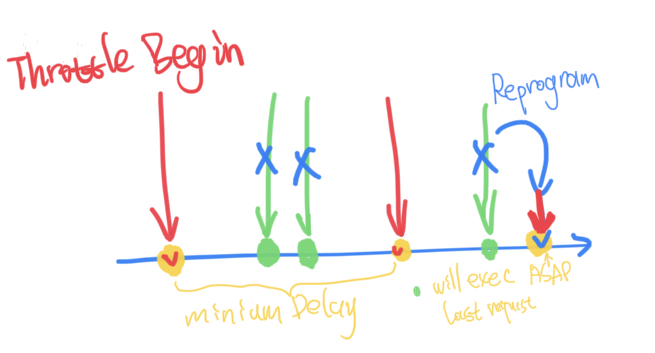

# SwiftThrottle

A **thread safe** throttle written in Swift licensed under [MIT](LICENSE).

## Introduction

This throttle is intended to prevent the program from crashing with too many requests or is used for saving computer resources.

**Swift Throttle is not designed for operations that require high time accuracy**

## Examples

I need a throttle that executes my code at most **once per second**, in the **main** thread.

```
let throttle = Throttle(minimumDelay: 1)
throttle.throttle { 
    print("it's default to main thread")
}
```

I need a throttle that executes my code at most **once per hour**, in **some background thread**.

```
let throttle = Throttle(minimumDelay: 3600, queue: .global())
throttle.throttle { 
    print("will async to global thread")
}
```

## Explanation

- The **first** execution is released **immediately** and the timestamp is recorded as **0**.
- Subsequent executions will enter the throttling control valve and will be **cancelled** if the execution interval is too short.
- The **last execution**, **if cancelled**, will be reprogrammed to execute **immediately after** the time reaches the required interval.



---

2021-08-01

Copyright © 2021 Lakr Aream. All rights reserved.
